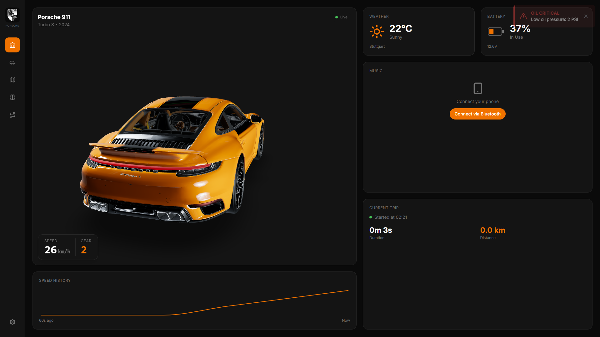
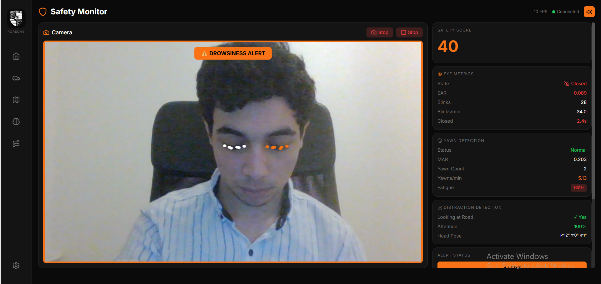
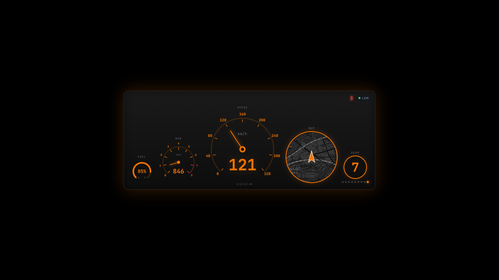

# 🏎️ AutoPulse - Connected Car Platform

<div align="center">

**Your car, smarter. Real-time monitoring, safety alerts, and predictive maintenance.**

[](https://python.org)
[](https://fastapi.tiangolo.com)
[](https://reactjs.org)
[](https://typescriptlang.org)
[](https://mediapipe.dev)

[What is AutoPulse?](#-what-is-autopulse) • [Features](#-what-can-it-do) • [Quick Start](#-quick-start) • [Technical Details](#-technical-details)

</div>

---

## 🚗 What is AutoPulse?

Imagine having a **smart assistant for your car** that:

- 📊 **Shows you everything** happening with your vehicle in real-time
- 🔧 **Predicts problems** before they leave you stranded on the road
- 👁️ **Watches your eyes** and alerts you if you're getting drowsy while driving
- 📈 **Scores your driving** and helps you become a safer, more efficient driver

AutoPulse is a **connected car platform** that brings Tesla-like intelligence to any vehicle. It's built as a demonstration of modern automotive software - the kind of technology used by Porsche, BMW, Mercedes, and other leading car manufacturers.

---

## ✨ What Can It Do?

### 📊 Live Dashboard
See your car's vital signs in real-time - speed, RPM, engine temperature, fuel level - all displayed on a beautiful dashboard with a **3D car model** that responds to your driving.

### 🔧 Predict Maintenance Needs
Using **machine learning**, AutoPulse analyzes your driving patterns and vehicle data to predict when parts might need attention - before something breaks. No more surprise breakdowns!

### 👁️ Drowsiness Detection
A camera watches your eyes while driving using **MediaPipe FaceLandmarker** and **EAR (Eye Aspect Ratio)** algorithms. If you start getting drowsy (eyes closing for too long), you'll get an **instant alert** - potentially saving your life. Features:
- Real-time eye tracking at 10+ FPS
- CNN-based eye state classification (MobileNetV2)
- Yawn detection via Mouth Aspect Ratio (MAR)
- Head pose distraction detection

### 🎨 Adaptive Themes
The interface changes based on how you're driving:
- 🏙️ **City Mode** (Calm cyan) - Urban driving
- 🛣️ **Highway Mode** (Cool blue) - Cruising
- 🔥 **Sport Mode** (Hot orange) - Spirited driving

### 📈 Trip Analytics
Every trip is recorded and analyzed. See your driving score, compare trips, and track your improvement over time.

---

## 🎬 See It In Action

### Main Dashboard
*Real-time vehicle monitoring with 3D visualization*



### Driver Safety Monitor
*AI-powered drowsiness detection*



### Driver HUD
*Minimal heads-up display for driving*



---

## 🏆 Why I Built This

This project demonstrates the skills that **German automotive companies** are looking for:

| What Companies Need | How AutoPulse Shows It |
|---------------------|------------------------|
| Real-time systems | Live data streaming at 1Hz |
| Machine Learning | Driver scoring with 92.7% accuracy |
| Computer Vision | Eye tracking & drowsiness detection |
| Full-stack development | React frontend + Python backend |
| 3D visualization | Interactive Three.js car model |
| Modern architecture | WebSockets, REST APIs, PostgreSQL |

---

# 🔧 Technical Details

*For developers and technical reviewers*

---

## 📋 Tech Stack

[](https://python.org)
[](https://fastapi.tiangolo.com)
[](https://reactjs.org)
[](https://typescriptlang.org)
[](https://postgresql.org)
[](https://mediapipe.dev)
[](https://xgboost.ai)

| Layer | Technologies |
|-------|--------------|
| **Frontend** | React 18, TypeScript, Tailwind CSS, Three.js, Recharts, Leaflet |
| **Backend** | FastAPI, SQLAlchemy, Pydantic, WebSockets |
| **Database** | PostgreSQL 15 |
| **ML** | XGBoost, scikit-learn, NumPy, Pandas |
| **CV** | MediaPipe, OpenCV, PyTorch (MobileNetV2) |
| **3D** | Three.js, React Three Fiber, GLTF models |

---

## 🏗️ Architecture

```
┌─────────────────────────────────────────────────────────────────────┐
│                           FRONTEND                                   │
│  ┌──────────────┐  ┌──────────────┐  ┌──────────────┐              │
│  │  Dashboard   │  │   Safety     │  │   Driver     │              │
│  │  + 3D Model  │  │   Monitor    │  │    HUD       │              │
│  │  (React)     │  │  (WebSocket) │  │  (Separate)  │              │
│  └──────┬───────┘  └──────┬───────┘  └──────┬───────┘              │
│         └─────────────────┴─────────────────┘                       │
│                           │                                          │
│              WebSocket + REST API (localhost:5173, 5174, 5175)      │
└───────────────────────────┼──────────────────────────────────────────┘
                            │
┌───────────────────────────┼──────────────────────────────────────────┐
│                     BACKEND (FastAPI)                                │
│  ┌─────────────────────────────────────────────────────────────────┐│
│  │                     API Routes                                   ││
│  │  /api/telemetry/*   - Readings, WebSocket, ML training          ││
│  │  /api/vehicles/*    - Vehicle CRUD                              ││
│  │  /api/trips/*       - Trip lifecycle                            ││
│  │  /api/scoring/*     - Driver behavior (rules + ML hybrid)       ││
│  │  /api/safety/*      - Drowsiness detection (WebSocket stream)   ││
│  │  /api/analytics/*   - Stats, exports, summaries                 ││
│  └─────────────────────────────────────────────────────────────────┘│
│                            │                                         │
│  ┌──────────────┐  ┌──────────────┐  ┌──────────────┐              │
│  │  ML Models   │  │  CV Models   │  │  Services    │              │
│  │  - XGBoost   │  │  - MediaPipe │  │  - Scoring   │              │
│  │  - Hybrid    │  │  - EAR algo  │  │  - Maint.    │              │
│  │    Scorer    │  │  - MobileNet │  │    Predictor │              │
│  └──────────────┘  └──────────────┘  └──────────────┘              │
│                            │                                         │
│  ┌─────────────────────────────────────────────────────────────────┐│
│  │              PostgreSQL Database                                 ││
│  │  vehicles | telemetry_readings | trips | safety_events          ││
│  └─────────────────────────────────────────────────────────────────┘│
└───────────────────────────┬──────────────────────────────────────────┘
                            │
┌───────────────────────────┼──────────────────────────────────────────┐
│                  VEHICLE SIMULATOR                                   │
│  ┌─────────────────────────────────────────────────────────────────┐│
│  │  Porsche 911 Physics Engine                                     ││
│  │  - Keyboard Control (1/2/3 = City/Highway/Sport)                ││
│  │  - Realistic acceleration, deceleration, gear shifts            ││
│  │  - Auto trip recording with mode tracking                       ││
│  │  - GPS coordinate simulation (Stuttgart area)                   ││
│  │  - 1 Hz telemetry POST to backend                              ││
│  └─────────────────────────────────────────────────────────────────┘│
└──────────────────────────────────────────────────────────────────────┘
```

---

## 🚀 Quick Start

### Prerequisites
- Docker & Docker Compose
- Python 3.11+ with pip
- Node.js 18+ with npm

### 1. Clone & Setup Database

```bash
git clone https://github.com/muhameddgoda/autopulse.git
cd autopulse

# Start PostgreSQL
docker-compose up -d

# Wait for DB to be ready
./scripts/check_db.sh
```

### 2. Start Backend

```bash
cd backend
python -m venv venv

# Linux/macOS:
source venv/bin/activate

# Windows PowerShell:
.\venv\Scripts\Activate.ps1

# Windows CMD:
venv\Scripts\activate.bat

pip install -r requirements.txt
python main.py
```

> **Note:** MediaPipe face landmark models (~30MB) are downloaded automatically on first run.

### 3. Start Frontend

```bash
cd frontend
npm install
npm run dev
```

### 4. Start Simulator

```bash
cd simulator
pip install -r requirements.txt
python vehicle_simulator.py
```

### 5. Open Applications

| Application | URL | Description |
|-------------|-----|-------------|
| Main Dashboard | http://localhost:5173 | Full telemetry dashboard |
| Driver HUD | http://localhost:5174 | Minimal driving display |
| Safety Monitor | http://localhost:5173/safety | Drowsiness detection |
| API Docs | http://localhost:8000/docs | Swagger UI |

---

## 🎮 Simulator Controls

| Key | Action |
|-----|--------|
| `1` | City Mode (25-50 km/h) |
| `2` | Highway Mode (110-140 km/h) |
| `3` | Sport Mode (140-220 km/h) |
| `P` | Park (ends current trip) |
| `R` | Reverse |
| `F` | Toggle low fuel warning |
| `Q` | Quit |

---

## 📡 API Endpoints

### Telemetry
| Method | Endpoint | Description |
|--------|----------|-------------|
| POST | `/api/telemetry/readings` | Ingest telemetry |
| GET | `/api/telemetry/readings/{vehicle_id}` | Get history |
| WS | `/api/telemetry/stream/{vehicle_id}` | Live stream |

### Trips
| Method | Endpoint | Description |
|--------|----------|-------------|
| POST | `/api/trips/start` | Start trip |
| POST | `/api/trips/{trip_id}/end` | End trip |
| GET | `/api/trips/{trip_id}` | Get trip details |

### Scoring
| Method | Endpoint | Description |
|--------|----------|-------------|
| GET | `/api/scoring/trips/{vehicle_id}` | Get scored trips |
| POST | `/api/scoring/trips/{trip_id}/score` | Score a trip |
| POST | `/api/scoring/trips/{trip_id}/hybrid` | ML hybrid scoring |

### Safety
| Method | Endpoint | Description |
|--------|----------|-------------|
| WS | `/api/safety/stream/{vehicle_id}` | Drowsiness WebSocket |
| GET | `/api/safety/status/{vehicle_id}` | Current drowsiness state |
| POST | `/api/safety/detect` | Single frame detection |

### Analytics
| Method | Endpoint | Description |
|--------|----------|-------------|
| GET | `/api/analytics/summary/{vehicle_id}` | Vehicle summary |
| GET | `/api/analytics/weekly/{vehicle_id}` | Weekly stats |
| GET | `/api/analytics/export/csv/{vehicle_id}` | Export CSV |

---

##  Project Structure

```
autopulse/
├── backend/
│   ├── app/
│   │   ├── api/           # REST + WebSocket endpoints
│   │   ├── cv/            # Computer vision (drowsiness)
│   │   ├── ml/            # Machine learning models
│   │   ├── models/        # SQLAlchemy ORM models
│   │   ├── schemas/       # Pydantic validation
│   │   └── services/      # Business logic
│   ├── models/            # Trained model files (.pth, .pt)
│   └── main.py
├── frontend/
│   ├── src/
│   │   ├── pages/         # Dashboard, Trips, Safety, etc.
│   │   ├── components/    # Reusable UI components
│   │   └── hooks/         # useTelemetry, etc.
│   └── public/models/     # 3D car model (GLTF)
├── driver-hud/            # Standalone driver display
├── simulator/             # Vehicle physics simulator
├── docs/                  # Documentation
└── docker-compose.yml
```

---

## 📊 ML Model Performance

| Model | Task | Accuracy | Notes |
|-------|------|----------|-------|
| Hybrid Scorer | Driver Behavior | 92.7% | XGBoost + Rules |
| EAR Detector | Drowsiness | Real-time | Eye Aspect Ratio algorithm |
| MobileNetV2 | Eye State | CNN | Backup eye classifier |

### Computer Vision Pipeline

The CV system supports **MediaPipe 0.10+** (Tasks API) for face landmark detection:
- **468 facial landmarks** tracked in real-time
- **EAR (Eye Aspect Ratio)** - Primary drowsiness metric
- **MAR (Mouth Aspect Ratio)** - Yawn detection
- **Head Pose** - Distraction detection via pitch/yaw angles

---

## 🎨 UI Themes

| Mode | Color | Trigger |
|------|-------|---------|
| 🅿️ Parked | Gray | Speed = 0, trip ended |
| 🔄 Reverse | Purple | Gear = R |
| 🏙️ City | Cyan | 0-60 km/h |
| 🛣️ Highway | Blue | 60-120 km/h |
| 🔥 Sport | Orange | 120+ km/h |

---

## 🔮 Future Enhancements

- [x] Real-time drowsiness detection
- [x] Hybrid ML scoring system
- [x] Anomaly detection (Isolation Forest)
- [ ] Failure prediction timeline
- [x] Enhanced head pose distraction detection
- [ ] PDF report generation
- [ ] Mobile companion app
- [ ] Cloud deployment (Railway/Vercel)

---

## 👤 Author

**Mohamed Goda Ebrahim** - BSc Robotics and Intelligent Systems

---

## 📄 License

MIT License - see [LICENSE](LICENSE)

---

<div align="center">

**Built with ❤️ for the German automotive industry**

🏎️ *Demonstrating skills for Porsche, BMW, Mercedes, and beyond* 🏎️

</div>
